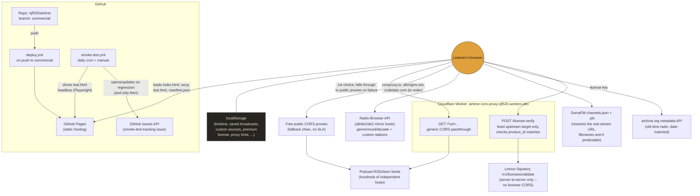

# Architecture

This exists so someone with zero memory of this project (including a future
version of whoever built it) can look at the repo and understand how the
pieces fit together, without reading 3,600 lines of `index.html` first. For
the *why* behind individual decisions, see [DEVELOPMENT.md](DEVELOPMENT.md)
— this file is the map, that one is the history.

## The one-sentence version

A single static HTML file, hosted for free on GitHub Pages, that talks
directly to a handful of third-party audio APIs from the browser — with one
small Cloudflare Worker in the loop only where the browser legally can't
reach an API on its own (CORS, or a license-key API that isn't meant to be
called from client-side JS at all).

## Diagram

## What talks to what, and why

**There is no backend the app owns.** No database, no server-side app code,
no user accounts. Everything about *this app's own state* lives in the
listener's browser (`localStorage`) or in the URL of a request going
straight to a third party. The only server-side code that exists at all is
the one Cloudflare Worker below, and it holds zero state of its own.

**GitHub Pages** serves the static files as-is from the `commercial` branch
— no build step, because there isn't one. `deploy.yml` runs on every push.

**The Cloudflare Worker** (`cors-proxy-worker.js` in this repo) exists for
exactly two things the browser cannot do unassisted:
1. **CORS proxying** (`GET /?url=`) — most podcast RSS feeds don't set
   `Access-Control-Allow-Origin`, since they're built for podcast apps, not
   browser JS. This is a dedicated, reliable first choice; if it's ever
   down, the app falls through to three free public CORS proxies with no
   uptime guarantee (`corsproxy.io`, `allorigins.win`, `codetabs.com`) —
   see `CORS_PROXIES` in `index.html`.
2. **License verification** (`POST /license-verify`) — Lemon Squeezy's
   license-validate API is meant for server-to-server calls and doesn't set
   CORS headers for a browser caller. This route forwards the request,
   confirms the returned `product_id` actually matches this product (not
   just *any* valid key from the same Lemon Squeezy store), and returns a
   simple `{success, message}` shape so `index.html` never needs to know
   Lemon Squeezy's response format.

Both routes are narrowly scoped (fixed upstream targets, not an open
relay) — see the file's own header comment for the redeploy process, since
Cloudflare Workers don't auto-deploy from this repo; a change here requires
manually pasting the file into the Cloudflare dashboard.

**Third-party APIs the browser calls directly** (no Worker involved) —
Radio-Browser (internet radio directory), SomaFM's channel list, and
archive.org's metadata API all set permissive CORS headers already, so
there's nothing for a Worker to solve there.

**The daily smoke test** (`.github/workflows/smoke-test.yml` +
`.github/scripts/smoke-test.js`) is a separate, small piece of CI-only
infrastructure — it does **not** run as part of the deployed app. A
scheduled GitHub Action drives `test.html` in a headless browser against
the *live* production site (same proxy chain real playback uses), then
reports regressions via a single tracking GitHub Issue that's updated in
place rather than spammed daily. See `DEVELOPMENT.md`'s "Freemium gate"
section for why this needed its own package.json (the app itself stays
dependency-free; this is CI tooling only).

## Files at a glance

| File | Role |
|---|---|
| `index.html` | The entire app — UI, playback logic, all state management. No build step. |
| `sw.js` | Service worker: caches the app shell for offline/installed use. `CACHE_NAME` must be bumped alongside `VERSION` in `index.html` on every deploy. |
| `manifest.json` | PWA manifest (name, icons, start URL). |
| `cors-proxy-worker.js` | Source of truth for the Cloudflare Worker's code — not auto-deployed, must be manually pasted into the Cloudflare dashboard after editing. |
| `test.html` | Manual + automated QA harness — tests every podcast-rss and fixed-URL internet-radio source against the real proxy chain / `<audio>` load path. |
| `.github/workflows/deploy.yml` | Pushes `commercial` to GitHub Pages. |
| `.github/workflows/smoke-test.yml` + `.github/scripts/smoke-test.js` | Daily automated regression check (see above). |
| `robots.txt`, `sitemap.xml` | Static SEO files, no logic. |
| `generate_icons.py` | One-off script that generated `icon-192.png`/`icon-512.png`; not run automatically, re-run manually if the icon design ever changes. |
| `README.md` | User-facing pitch — what the app is and how to use it. |
| `DEVELOPMENT.md` | Engineering log — chronological record of *why* things are built the way they are, including dead ends. |
