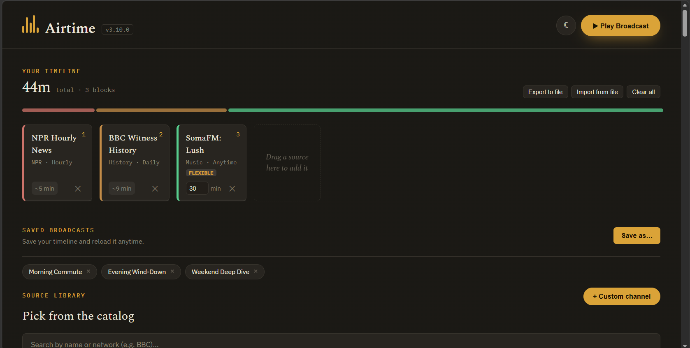

# Airtime

**Build your own radio station out of the podcasts and internet radio you actually like — then hit play and it just runs.**

### [▶ Try it live — no sign-up, no account](https://njf520.github.io/airtime/)

<!-- TODO: add a screenshot of the timeline view here, e.g.

-->

Drag news briefings, science shorts, comedy, true crime, old-time radio drama, and internet-radio genre/decade/mood mixes into a single timeline, and Airtime plays it back to back like a real broadcast — each podcast block streams its actual latest episode, each radio block streams a real live station. When one block ends (or its time is up), the next one starts automatically.

## Why

Every podcast app makes you pick one show and listen to it start to finish. Airtime lets you build a *lineup* — five minutes of news, then a science story, then a comedy bit, then live music — exactly like a real morning show, and it remembers your lineup so you can just hit play tomorrow.

## What you get

- **160+ curated sources, zero setup.** NPR, BBC, AP, and dozens of independent podcasts, plus commercial-free internet radio (SomaFM, Radio Paradise, KEXP) and a handful of AM/FM stations — browse by category, length, or format, no account or API key needed for any of it.
- **It actually plays, for real.** Podcast blocks fetch their real latest episode and stream it; radio blocks connect to a live station. Transport controls, a progress bar, and smooth fade transitions between blocks — not a mockup.
- **Save it, reuse it, take it anywhere.** Build a lineup once as a "saved broadcast" and reload it any day — it always grabs whatever's currently latest, not a stale snapshot. Export/import as a file to move a lineup between devices. A few starter lineups (Morning Commute, Evening Wind-Down, Weekend Deep Dive) are there from your very first visit.
- **Works like an app.** Installable to your phone's home screen (Android/desktop) as a PWA — opens full-screen, no browser chrome, works offline for the parts that don't need a live network connection.
- **Search for your own radio station.** Type any genre, mood, or vibe ("lofi," "80s rock," "talk radio") and it searches live internet radio for a real match — no need to wait for us to add it to the catalog.

## Getting started

1. Open **[the live site](https://njf520.github.io/airtime/)** — nothing to install to try it.
2. Hit **Play** on one of the starter broadcasts, or drag a few sources of your own into the timeline.
3. Like what you built? Save it as a named broadcast so it's one click away next time.
4. On your phone, use "Add to Home screen" to install it like an app.

Found a broken source or something weird? There's a **🐛 Report a bug / feedback** link in the footer — it opens a pre-filled GitHub issue with the details we'd need to fix it.

## Curious how it's built?

See **[DEVELOPMENT.md](DEVELOPMENT.md)** for the full engineering story — no backend, no build step, no framework, one HTML file, and a lot of live-tested detail on how it fetches podcast RSS around CORS, resolves internet radio streams, and handles the dozens of little edge cases that come with aggregating hundreds of independently-run audio sources.
